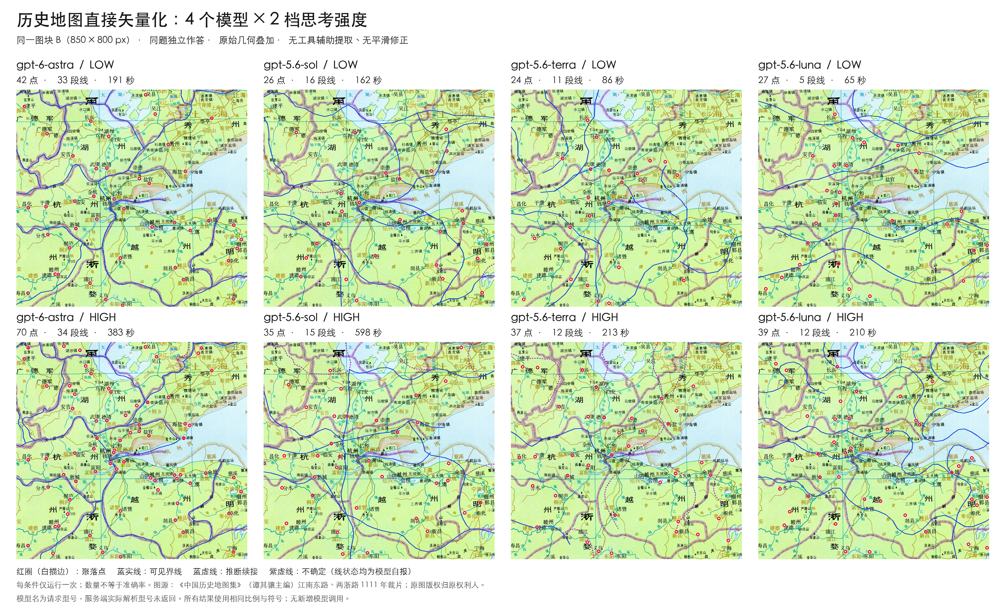
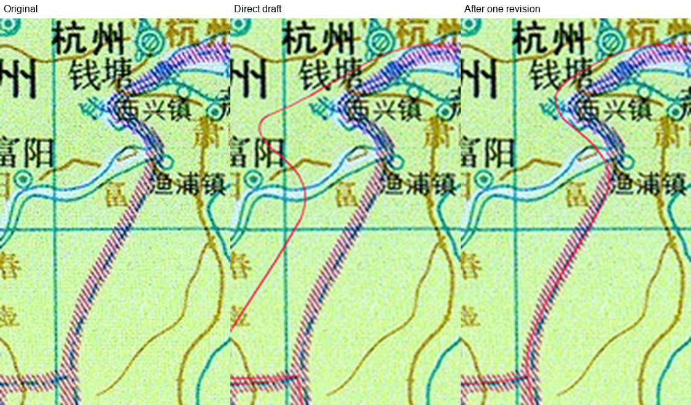
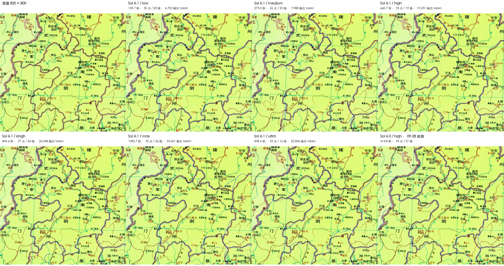

<div align="center">

# gis-kit

**Everyday GIS operations as scripts, easy for AI agents to call.**

A skill for Claude Code, Codex and other agents.

[](LICENSE)
[](requirements-tested.txt)
[](https://github.com/shio-vinyl/gis-kit/actions/workflows/tests.yml)
[](SKILL.md)

[中文](README.md) · English

</div>

---

## About

This is the GIS toolbox I use myself. I have written more than 40 scripts for operations I find useful in everyday work.

A single entry point lets an agent list and search the tools, read their parameters through `--help`, and combine them for a task.

```bash
python scripts/gis.py list                # tool catalogue (standard library only)
python scripts/gis.py list --search raster
python scripts/gis.py raster --help       # parameter reference
```

[SKILL.md](SKILL.md) records basic requirements for handling data: check CRS, units and NoData, and preserve states such as `candidate` / `hold`. The agent decides which tools to use and how to connect them.

I use it for ordinary-sized tasks. For larger datasets or higher performance requirements, an agent can call GIS backends such as QGIS or GRASS. Large tables can also use the optional DuckDB spatial SQL tools.

I will keep adding tools as I need them, including some research-oriented features.

## Tools

1. Vector tools cover clipping, dissolving, merging, spatial joins and buffers, along with field and topology checks and repairs, area calculations and urban metrics. Everyday results can be saved as versioned bundles.
2. Raster and terrain tools support zonal statistics, reprojection and COG output, with windowed processing for large rasters. DEM tools calculate slope, aspect, contours and profiles; hydrology, viewsheds and terrain cost can use the optional GRASS backend.
3. Network tools handle directed road networks, OD and facility coverage scenarios, including demand-weighted coverage. They do not report population coverage without demand weights.
4. Semantic raster vectorization uses a model to read an image and draw points, lines and polygons. Scripts handle coordinate conversion, version records, geometry checks and export. I mainly use historical maps for this research and currently recommend GPT-6 Astra and GPT-6.1; the workflow and tests are described below.
5. For repeated tasks, `--trace` records the steps actually run. These can be turned into a recipe for the next batch of data. `semantic-check` checks whether specified semantic fields were lost or changed between steps.

## Semantic raster vectorization

gis-kit has a workflow in which a multimodal model reads a raster image and draws points, lines and polygons on it. The model identifies targets, chooses line paths and defines polygon boundaries. Scripts crop the image, convert coordinates, record versions, check geometry, produce comparison overlays and export files.

The model's coordinates are written in the original image's pixel coordinate system. It draws both polylines and cubic Bézier curves, and I preserve its control points unchanged. If a curve comes from programmatically smoothing a polyline, I label it separately and do not count it as model-drawn.

So far, I have mainly used historical maps for research and testing.

### Background

Converting raster maps into vectors used to rely largely on manual tracing, with limited help from models. GPT-6 Astra brought a noticeable improvement in the GPT series' image reading and annotation, which prompted me to take this seriously.

The test material comes from four sources: two 850×800 crops from Tan Qixiang's *The Historical Atlas of China*, a 1926 map of northwestern France from Stanford's digital map collection, a 1789 map of Hessen, and an 1829 map of Rhode Island.

The tests suggest that models can do this work, but **cost is the main obstacle** to using the workflow at scale.

I currently use and recommend GPT-6 Astra and GPT-6.1. The earlier 5.6 series performed poorly, Luna remains unreliable, and I could not make 6.0 Sol work for my purposes. By “can do this work,” I mean producing a vector draft worth reviewing and refining. I have not measured accuracy, and every result needs review.

Since 6.1 Sol was released, I have found that it completes the workflow fairly consistently and costs much less than Astra. I have not tested this systematically yet; this is an observation from use, which I plan to follow up.



*Early model comparison: one run per condition on the same crop, with uncorrected predictions. Point and line counts are not accuracy measures. Open the image to inspect it at full size.*

### Findings from the tests

1. Settlement points usually correspond to the map symbols, but boundary paths have consistently been a weakness.
2. Showing the model its vectors overlaid on the source image and asking for one revision corrects some obvious detours. I did not see closer alignment when switching from polylines to Bézier curves.
3. Geometry checks only detect geometric errors. A line taking a large detour can still pass a self-intersection check.
4. Shared nodes keep adjacent tiles connected, but the connection's location still needs human review. I have seen two tiles reference the same node and both connect at the wrong location.
5. Full map sheets remain difficult. Missing features, wrong connections, complex coastlines, insets and polygon coverage need individual checks. I paused further tracing after one full-sheet result failed an independent review.
6. I compared six reasoning-effort settings on two crops, for twelve single-turn extractions. Lower effort worked for rough geometry; higher effort did better at distinguishing historical from modern features and covering the targets. Beyond that, no setting was consistently better.
7. To reduce cost, I replaced edge-by-edge submissions with batches grouped by junction. Initial submissions fell from 39 to 24, but model requests rose from 55 to 63, and token use increased too.



*Astra / low: source image, draft and result after one revision, from left to right. The obvious detour was corrected, but local deviations remain. The result is still a candidate for review.*

### Workflow

The model reads and submits one local area at a time. Each area is saved as a separate patch, so an error can be revisited locally.

Lines are split at actual junctions and share nodes. Directed shared edges form polygon outer rings and holes. Shape changes and connectivity changes are handled separately, and a revision can affect only a small part of the drawing.

Scripts check self-intersections, overlaps, out-of-bounds geometry and polygon validity. They cannot detect semantic omissions. Review packs use numbered regions, and human feedback is recorded as accepted, rejected or pending.

Exports include annotation JSON, SVG preserving native curves, and GeoPackage point, line and polygon layers. Unclosed or invalid polygons are listed as omissions; the scripts do not fill them in automatically.

Tracing and georeferencing are separate steps. Unreferenced results stay in pixel engineering space without a geographic CRS. **I do not attach longitude and latitude labels to unreferenced data and publish it as geographic data.** When geographic coordinates are needed, control-point georeferencing records independent check-point errors, acceptance status and a handoff manifest.

Passing georeferencing only means meeting the geometric criteria declared in advance. The correctness of an object's location and historical affiliation needs a separate assessment. Existing tracing can be reused after georeferencing without redrawing it.

### Usage notes

1. I do not recommend high reasoning effort by default for drawing. When a closer judgment is needed, review is a more useful place to apply it. I have not run a controlled comparison of higher-effort review; this is workflow experience.
2. Review should not become an endless loop of self-review and revisions. I treat four cases as blockers: an entire missing edge, a connection to the wrong object, a missing important area, or a disconnected seam. I record other issues and prioritize corrections that affect use.
3. Most tests are small-sample, single-run experiments. They support discussion of usability, alignment, coverage and wrong connections, but are not enough to establish accuracy.

<details>
<summary>GPT-6.1 comparison across six reasoning-effort settings (Fujian crop)</summary>



*2026-09-30: one independent, single-turn extraction per setting on the same 850×800 crop, without repairs. The figure also includes a Sol 6.0 / high result from September 28. Duration includes factors such as queueing, and output tokens include reasoning tokens. This small comparison provides neither accuracy measurements nor a controlled speed ranking. Open the image for the full-size version. Figure headings and annotations are in Chinese.*

</details>

Automatic tiling and seam merging have not been implemented. Treat every output as a candidate for review, not a finished product.

See the [annotation workflow](references/raster-annotation.md), [object and record contract](references/raster-schema.md), and [georeferencing workflow](references/raster-georeferencing.md). These reference documents are in Chinese.

## Quick start

**1. Install** by cloning into your agent's skills directory. Keep the directory name `gis-kit`.

```bash
# Claude Code
git clone https://github.com/shio-vinyl/gis-kit.git ~/.claude/skills/gis-kit
# Codex
git clone https://github.com/shio-vinyl/gis-kit.git ~/.codex/skills/gis-kit
```

**2. Set up Python** (Python ≥ 3.10).

```bash
python3.10 -m venv ~/.venvs/gis-kit
~/.venvs/gis-kit/bin/python -m pip install -r ~/.claude/skills/gis-kit/requirements-full.txt
~/.venvs/gis-kit/bin/python ~/.claude/skills/gis-kit/scripts/daily.py environment
```

**3. Ask the agent** to carry out a task.

> Dissolve `parcels.gpkg` by land-use type, compute areas in a CGCS2000 projection, and produce a QA plot.
>
> Compute slope and aspect from this DEM and report mean slope for each district.
>
> Calculate 15-minute drive-time coverage for these hospitals and list the neighbourhoods left uncovered.
>
> Trace the roads on this scanned historical map and georeference it using my control points.

The agent reads [SKILL.md](SKILL.md), consults the relevant `references/` documents as needed, and selects tools and parameters.

## Environment and dependencies

1. `requirements-core.txt` contains the core dependencies for vector and raster processing and QA plots.
2. `requirements-full.txt` adds networks, statistics, image enhancement and test tools.
3. `requirements-tested.txt` records the exact versions used when the full suite passed on Python 3.10.
4. `requirements-spatial-sql.txt` provides the optional DuckDB spatial SQL dependencies.

If installing GDAL-related packages with pip is difficult, use `environment.yml` to create a conda-forge environment.

The agent should use the same Python interpreter throughout a task; see [Runtime environment](references/runtime-environment.md). QGIS, GRASS and PySAL are optional backends and need separate installation.

Chinese map labels use the first installed font in the order listed in `config/user.yaml`, with Noto Sans CJK SC as the default. If none is installed, the fallback is DejaVu Sans, which cannot display Chinese text correctly.

Finished maps, Scene / Storyboard and map videos are handled by my other project, gis-composer. It is not public yet; I want to spend more time on it before release.

gis-kit does not depend on gis-composer and can produce diagnostic and QA plots on its own. If gis-composer is installed, use `GIS_COMPOSER_HOME` to specify its location.

## Tests

```bash
PYTHONDONTWRITEBYTECODE=1 python -m pytest -q -p no:cacheprovider tests
```

`tests/test_*.py` are self-contained regression tests using synthetic or hand-computed data.

`tests/run_*_acceptance.py` check complete processing chains with real files. Supply external data such as OSM, Natural Earth or a DEM, and keep output directories outside the repository. Each script lists its required inputs at the top.

## Data and privacy

The scripts run locally, but content read by the agent may enter a remote model's context. `--trace` records include file paths and task parameters; check them before sharing.

The repository does not include complete third-party datasets. Test figures use crops from Tan Qixiang's *The Historical Atlas of China*. The underlying maps remain the property of their rights holders and are not covered by this repository's code license. Follow the applicable license and attribution requirements when using OSM (ODbL), Natural Earth (public domain) or other data.

## License

[Apache License 2.0](LICENSE)

<sub>Keywords: GIS · geospatial · AI agent · Claude Code skill · Codex skill · Agent Skills · LLM tools · GeoPandas · Rasterio · GDAL · Shapely · DuckDB · DEM · terrain analysis · network analysis · accessibility · georeferencing · map digitization · spatial analysis</sub>
