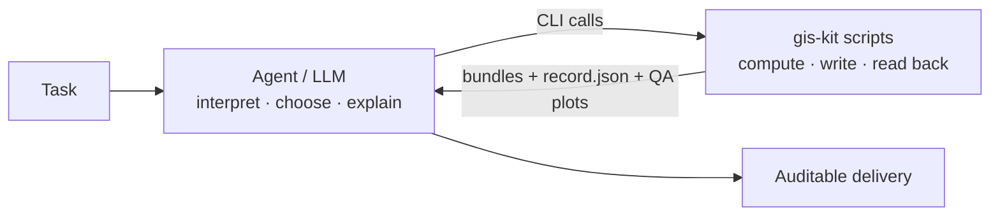

<div align="center">

# gis-kit

**Reliable GIS for AI agents: the model decides, the scripts compute.**

A GIS skill for Claude Code, Codex and other AI agents that covers vector and raster processing, spatial analysis, DEM terrain, network accessibility, and tracing and georeferencing scanned maps.

[](LICENSE)
[](requirements-tested.txt)
[](https://github.com/shio-vinyl/gis-kit/actions/workflows/tests.yml)
[](SKILL.md)

[中文](README.md) · English

</div>

---

## Why gis-kit

When an LLM writes GeoPandas code on its own, the mistakes are familiar: a CRS label mistaken for a reprojection, degrees used as if they were metres, NoData leaking into statistics. The output looks plausible and is quietly wrong.

gis-kit splits the work:

- **The model** interprets the task, looks things up, chooses tools and explains the results.
- **The scripts** do deterministic computation, atomic writes, read-back checks and QA plots, and carry `candidate` / `hold` status through every step.

Every step leaves files you can audit. Anything inferred or unverified is labelled as such instead of being reported as fact.



## What it does

| Area | Capabilities |
|---|---|
| 🗺️ **Vector** | Clip, dissolve, merge, spatial join, buffer, field and topology checks and fixes, area and urban indicators, all written as versioned, atomic result bundles |
| 🏔️ **Raster & terrain** | Explicit-grid calculation, zonal statistics, reprojection and COG output, with windowed processing for large rasters; DEM slope, aspect, contours and profiles; optional GRASS hydrology, visibility and terrain cost |
| 🛣️ **Networks & coverage** | Directed networks, OD matrices, service segments, facility-coverage scenarios and demand-weighted coverage bounds. Population coverage is not reported when demand weights are missing |
| 📜 **Scanned maps** | The model draws objects directly in pixel space; scripts handle non-generative crops and enhancement, coordinate conversion, versioning, overlay checks and affine / TPS georeferencing |
| ⚡ **Scale & reuse** | Optional DuckDB spatial SQL writing validated (Geo)Parquet; recipes and traces for repeated delivery; `semantic-check` to catch semantic fields lost between steps |

Every one of the 40+ tools can be found from a single entry point:

```bash
python scripts/gis.py list            # tool catalog (standard library only)
python scripts/gis.py list --search raster
python scripts/gis.py raster --help   # native argument help
```

## Quick start

**1. Install the skill**: clone it into your agent's skills directory, keeping the directory name `gis-kit`.

```bash
# Claude Code
git clone https://github.com/shio-vinyl/gis-kit.git ~/.claude/skills/gis-kit
# Codex
git clone https://github.com/shio-vinyl/gis-kit.git ~/.codex/skills/gis-kit
```

**2. Set up Python** (≥ 3.10)

```bash
python3.10 -m venv ~/.venvs/gis-kit
~/.venvs/gis-kit/bin/python -m pip install -r ~/.claude/skills/gis-kit/requirements-full.txt
~/.venvs/gis-kit/bin/python ~/.claude/skills/gis-kit/scripts/daily.py environment
```

**3. Ask your agent**

> Dissolve `parcels.gpkg` by land-use type, compute areas in a projected CRS, and give me a QA plot.
>
> Compute slope and aspect for this DEM and the mean slope per district.
>
> Which neighbourhoods are outside a 15-minute drive of these hospitals?
>
> Trace the roads on this scanned historical map and georeference it with my control points.

The agent reads [SKILL.md](SKILL.md) and the relevant files in `references/`, then chooses the tools and parameters itself. The documentation is written in Chinese; the CLI help is in English.

## Dependency layers

| File | Purpose |
|---|---|
| `requirements-core.txt` | Vector, raster, metrics, QA plots |
| `requirements-full.txt` | Core, plus networks, statistics, image enhancement, table export and pytest |
| `requirements-tested.txt` | Exact versions that passed the full suite on Python 3.10 |
| `requirements-spatial-sql.txt` | Optional DuckDB spatial SQL |
| `environment.yml` | conda-forge environment for platforms where pip GDAL wheels are awkward |

The agent should run every command with the same interpreter; see the [runtime environment](references/runtime-environment.md) guide. QGIS, GRASS and PySAL are optional backends that need their own installation and verification.

For Chinese labels, the scripts use the first installed font listed in `config/user.yaml` (Noto Sans CJK SC by default). If none of them is installed, they fall back to DejaVu Sans, which has no CJK glyphs.

## Design principles

- **Know the data first.** Before any processing, confirm the layer or band, CRS, units, grid and NoData, and whether values are totals, densities, rates or categories.
- **Read results back.** Every output's values, geometry and CRS are re-read through the real interface, and QA plots are actually opened and looked at.
- **Don't overclaim.** A program finishing, a geometric gate passing and a human accepting the result are recorded separately. A georeferencing `pass` means only that pre-declared gates were met.
- **Keep the harness thin.** Mature libraries and CLIs are used directly; something is added to gis-kit only when it keeps coming up and wrapping it makes the results clearly more reliable.

## Relationship to gis-composer

Production maps, Scene/Storyboard output and map videos are handled by the separate gis-composer runtime, located via `GIS_COMPOSER_HOME`. gis-kit does not depend on it; diagnostic and QA plots work without it.

## Tests

```bash
PYTHONDONTWRITEBYTECODE=1 python -m pytest -q -p no:cacheprovider tests
```

`tests/test_*.py` are self-contained regression tests on synthetic or hand-calculated data. `tests/run_*_acceptance.py` run real file chains: you supply the external data (for example OSM, Natural Earth or DEMs), and the output directory must be outside the repository. Each script's header lists the inputs it needs.

## Data and privacy

The scripts run locally, but anything the agent reads may end up in a remote model's context. Traces written with `--trace` record paths and business parameters, so review them before sharing. The repository ships no third-party datasets; if you use OSM (ODbL), Natural Earth (public domain) or similar data, follow their licences and attribution requirements.

## License

[Apache License 2.0](LICENSE)

<sub>Keywords: GIS · geospatial · AI agent · Claude Code skill · Codex skill · Agent Skills · LLM tools · GeoPandas · Rasterio · GDAL · Shapely · DuckDB · DEM · terrain analysis · network analysis · accessibility · georeferencing · map digitization · spatial analysis</sub>
