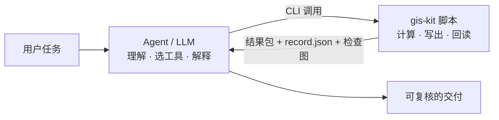

<div align="center">

# gis-kit

**让 AI agent 可靠地做 GIS：模型负责判断，脚本负责算准。**

一个面向 Claude Code、Codex 等 AI agent 的 GIS skill：矢量与栅格处理、空间分析、DEM 地形、路网可达，以及扫描地图描绘与配准。

[](LICENSE)
[](requirements-tested.txt)
[](https://github.com/shio-vinyl/gis-kit/actions/workflows/tests.yml)
[](SKILL.md)

中文 · [English](README.en.md)

</div>

---

## 为什么是 gis-kit

让大模型直接写 GeoPandas 代码，常见的问题是 CRS 标签被当成重投影、经纬度被当成米、NoData 混进统计，结果看起来合理，实际却是错的。

gis-kit 的做法是明确分工：

- **模型**负责理解任务、查找资料、选择工具、解释结果；
- **脚本**负责确定性计算、原子写出、文件回读和检查图，并把 `candidate` / `hold` 等状态一路保留下来。

每一步都会落成可以复查的文件。只要是推定或者未验证的内容，都会标注出来，不会写成确定结论。



## 能做什么

| 领域 | 能力 |
|---|---|
| 🗺️ **矢量** | 裁剪、融合、合并、空间关联、缓冲、字段与拓扑检查修复、面积与城市指标；输出版本化、原子写出的日常结果包 |
| 🏔️ **栅格与地形** | 显式格网计算、分区统计、重投影、COG 输出，大栅格按窗口处理；DEM 坡度、坡向、等高线、剖面；可选 GRASS 水文、可视域和地形成本 |
| 🛣️ **路网与覆盖** | 有向路网、OD、服务路段、设施覆盖情景、需求加权覆盖的上下界；缺少需求权重时不报告人口覆盖率 |
| 📜 **扫描地图** | 模型在像素空间直接描绘对象，程序负责非生成式裁剪增强、坐标换算、版本管理、叠加检查，以及仿射 / TPS 配准 |
| ⚡ **规模与复用** | 可选 DuckDB 空间 SQL，输出经过校验的 (Geo)Parquet；recipe 与 trace 支持重复交付；`semantic-check` 检查语义字段在步骤之间是否丢失 |

40 多个工具都能通过统一入口查到：

```bash
python scripts/gis.py list            # 工具目录（只需标准库）
python scripts/gis.py list --search raster
python scripts/gis.py raster --help   # 原生参数说明
```

## 快速开始

**1. 安装 skill**：克隆到 agent 的 skills 目录，目录名保持 `gis-kit`。

```bash
# Claude Code
git clone https://github.com/shio-vinyl/gis-kit.git ~/.claude/skills/gis-kit
# Codex
git clone https://github.com/shio-vinyl/gis-kit.git ~/.codex/skills/gis-kit
```

**2. 准备 Python 环境**（Python ≥ 3.10）

```bash
python3.10 -m venv ~/.venvs/gis-kit
~/.venvs/gis-kit/bin/python -m pip install -r ~/.claude/skills/gis-kit/requirements-full.txt
~/.venvs/gis-kit/bin/python ~/.claude/skills/gis-kit/scripts/daily.py environment
```

**3. 直接对 agent 说**

> 把 `parcels.gpkg` 按用地类型融合，用 CGCS2000 投影算面积，出一张检查图。
>
> 算出这块 DEM 的坡度和坡向，统计每个行政区的平均坡度。
>
> 给这几个医院算 15 分钟车程覆盖，列出覆盖不到的小区。
>
> 把这张扫描老地图上的道路描出来，用我给的控制点配准。

agent 会读取 [SKILL.md](SKILL.md) 和 `references/` 里对应的参考文档，自己选择工具和参数。

## 依赖分层

| 文件 | 用途 |
|---|---|
| `requirements-core.txt` | 矢量、栅格、计量、检查图 |
| `requirements-full.txt` | 核心依赖，加上路网、统计、图像增强、表格导出、pytest |
| `requirements-tested.txt` | Python 3.10 下完整测试通过的精确版本 |
| `requirements-spatial-sql.txt` | 可选的 DuckDB 空间 SQL |
| `environment.yml` | conda-forge 环境，适合用 pip 装 GDAL 相关包有困难的平台 |

agent 运行时应当始终使用同一个解释器，详见[运行环境](references/runtime-environment.md)。QGIS、GRASS、PySAL 属于可选后端，需要单独安装和验证。

中文图面按 `config/user.yaml` 里的顺序选用第一个已安装的字体，默认是 Noto Sans CJK SC；一个都没装时回退到 DejaVu Sans，这个字体不含中文字形。

## 设计原则

- **先弄清数据**：动手前先确认图层、CRS、单位、格网、NoData，以及数值是总量、密度、比率还是类别。
- **结果要能回读**：每个输出都按实际接口重新读一遍数值、几何和 CRS，检查图也要实际打开看。
- **不夸大结论**：程序跑完、几何门槛通过、人工接受是三件事，分开记录。配准 `pass` 只说明通过了预先声明的门槛。
- **薄封装**：优先直接调用成熟的库和 CLI，只有反复出现、封装后确实更稳定的需求才加进 gis-kit。

## 与 gis-composer 的关系

正式地图、Scene / Storyboard 和地图影片由独立的 gis-composer 运行时负责，通过 `GIS_COMPOSER_HOME` 定位。gis-kit 本身不依赖它，没有 composer 也能照常生成诊断图和检查图。

## 测试

```bash
PYTHONDONTWRITEBYTECODE=1 python -m pytest -q -p no:cacheprovider tests
```

`tests/test_*.py` 是自包含的回归测试，数据都是合成的或手算的。`tests/run_*_acceptance.py` 是真实文件链验收，需要自己准备外部数据（如 OSM、Natural Earth、DEM），输出目录必须放在仓库之外；每个脚本开头都写明了需要哪些输入。

## 数据与隐私

脚本在本地运行，但 agent 读到的内容可能会进入远端模型的上下文。`--trace` 生成的轨迹会记录路径和业务参数，分享前请先检查。仓库不附带任何第三方数据集；使用 OSM（ODbL）、Natural Earth（公有领域）等数据时，请遵守对应的许可证和署名要求。

## 许可证

[Apache License 2.0](LICENSE)

<sub>关键词：GIS · geospatial · AI agent · Claude Code skill · Codex skill · Agent Skills · LLM · GeoPandas · Rasterio · GDAL · Shapely · DuckDB · DEM · terrain analysis · network analysis · georeferencing · 空间分析 · 地理信息 · 地图配准</sub>
